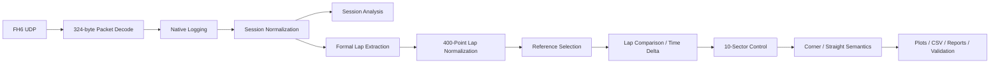
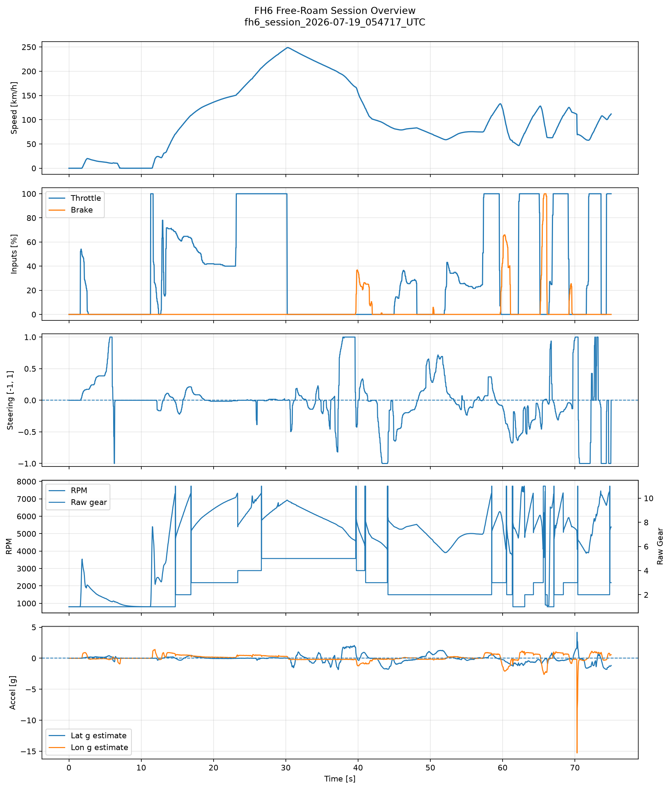
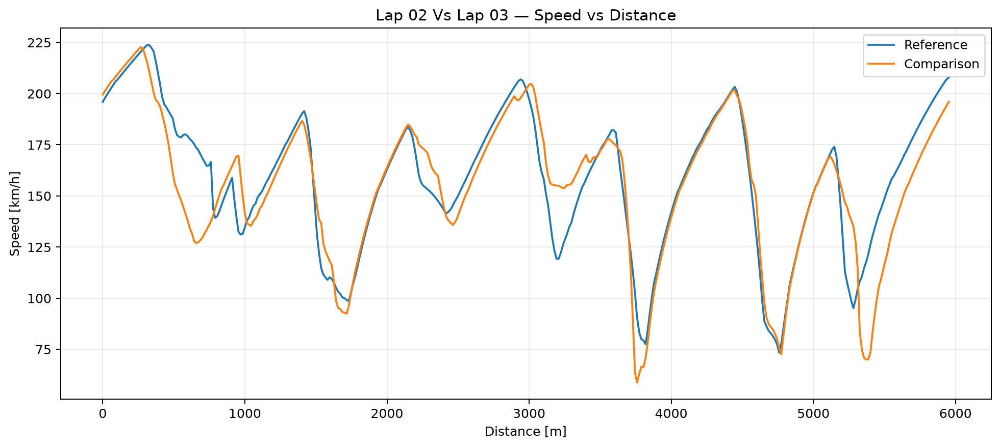
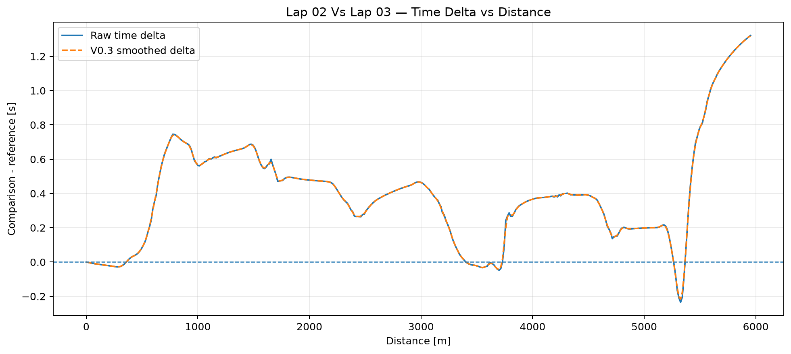
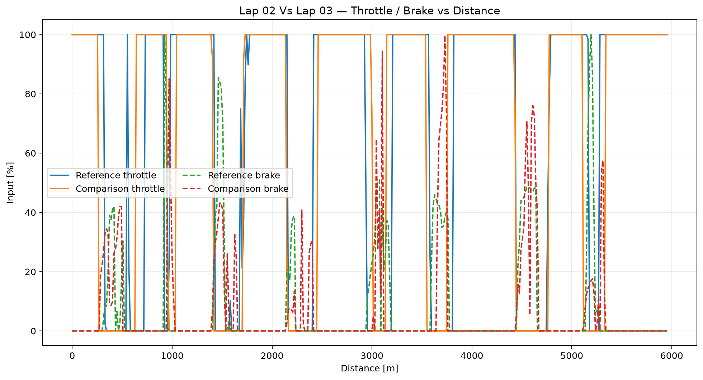
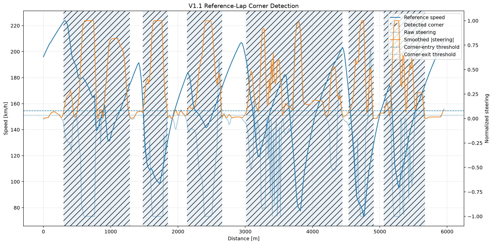
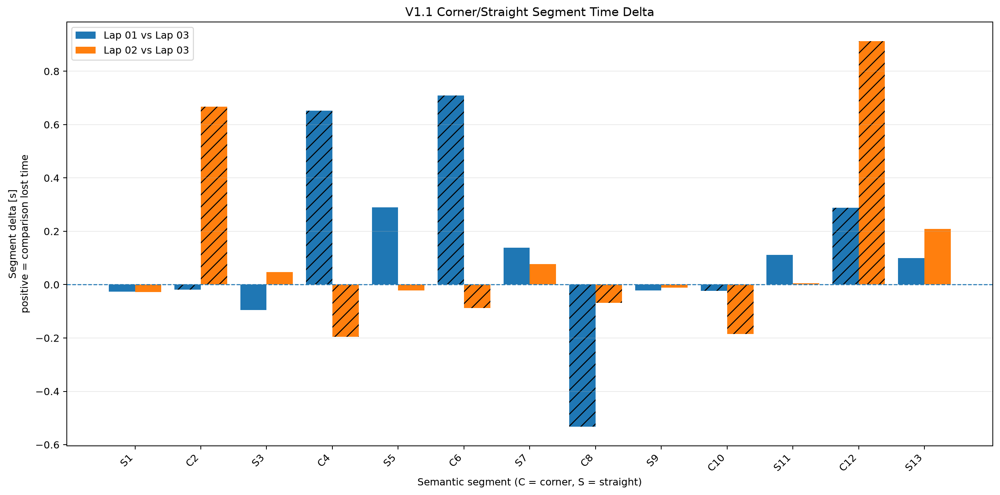

# Motorsport Telemetry & Vehicle Dynamics Analyzer

**Status: In Development — validated FH6 session-level, formal-lap, sector, and corner-aware analysis milestones are complete; development is currently paused between milestones.**

Python engineering project for acquiring, validating, normalizing, analyzing, comparing, and reporting motorsport telemetry. The current validated implementation combines **Forza Horizon 6 Data Out UDP acquisition** with a structured real-telemetry analysis pipeline for sessions, laps, sectors, and telemetry-derived corner/straight regions.

> This repository is a curated public showcase. The private development repository remains the complete engineering source and validation authority.

## Engineering Objective

The project is designed to turn source-native telemetry into engineering evidence through a modular workflow:

- acquire and decode telemetry;
- preserve source-native data;
- validate and normalize channels;
- compute session/lap metrics;
- align laps on common distance;
- estimate cumulative time delta;
- compare speed and driver inputs;
- identify gain/loss behavior;
- decompose comparisons by fixed sectors and semantic corner/straight regions;
- generate plots, CSV outputs, reports, and regression checks.

## Architecture



See [`docs/architecture.md`](docs/architecture.md) for the validated stage map and design boundaries.

## Validated Milestones

| Milestone | State | Representative evidence |
|---|---|---|
| FH6 Session-Level Telemetry V1.0 | **FROZEN / VALIDATED** | 17/17 verify-only checks; 6 cataloged sessions; 4 controlled-purpose sessions; complete required artifacts |
| FH6 Formal-Lap Analysis V1.0 | **FROZEN / VALIDATED** | 3 complete real FH6 laps; 400-point normalization; 2 real comparisons; 12 comparison figures; V1.0 regression PASS |
| V1.1 Reference + Sector Foundation | **VALIDATED BASELINE** | automatic Lap 03 reference; 10-sector full-distance timing reconstruction |
| V1.1 Corner-Aware Semantic Analysis | **VALIDATED BASELINE** | 13 segments = 6 corners + 7 straights; cross-baseline timing agreement; 4 semantic-analysis figures |

Full public validation detail: [`docs/validation-summary.md`](docs/validation-summary.md).

## Native FH6 Acquisition

The acquisition layer uses FH6 Data Out telemetry over UDP and preserves the source-native record before analysis.

Representative implementation facts:

- UDP port: **53000**
- fixed packet size: **324 bytes**
- decoded native fields: **88**
- representative validated sessions: **1,800 rows in ~60.031 s** (approximately 30 samples/s)
- recorded channels include speed, RPM, throttle, brake, steering, gear, position, acceleration, power, torque, lap timing, and additional native fields.

The public code includes the decoder, receiver, logger, normalization adapter, and selected analysis stages under [`src/`](src/).

## Representative Real-Lap Validation Anchor

Protected baseline from the validated FH6 formal-lap dataset:

| Lap | Elapsed time | Delta vs. Lap 03 |
|---|---:|---:|
| **Lap 03 (reference)** | **62.584166 s** | **0.000000 s** |
| Lap 02 | 63.905411 s | +1.321244489 s |
| Lap 01 | 64.156156 s | +1.571989647 s |

Additional baseline contracts:

- common normalized distance: **5953.017578 m**
- normalized grid: **400 points**
- fixed mathematical sectors: **10**
- V1.1 semantic partition: **13 segments / 6 corners / 7 straights**

The public extracts are in [`examples/data/`](examples/data/).

## Visual Results

### Real FH6 session overview



### Distance-aligned lap speed comparison



### Cumulative time delta



### Driver-input comparison



### Telemetry-derived corner detection



### Semantic segment delta decomposition



## Selected Source Code

This showcase intentionally publishes a **curated subset** instead of exposing the complete development repository. Selected modules demonstrate:

- binary packet decoding and UDP transport;
- structured native logging;
- normalization and robust distance handling;
- session metrics/event analysis;
- formal-lap readiness, extraction, and normalization;
- automatic reference selection;
- distance-aligned real-lap comparison;
- semantic corner/straight segmentation;
- comparative plotting.

The selection rationale is documented in [`docs/publication-manifest.md`](docs/publication-manifest.md).

## Limitations

- FH6 telemetry is game telemetry, not calibrated real-vehicle instrumentation.
- Controlled free-roam captures are engineering test captures, not laboratory-grade tests.
- The validated formal-lap dataset is suitable for the implemented pipeline but is not presented as a professional race-engineering dataset.
- The 10 fixed sectors are mathematical controls.
- V1.1 corner/straight boundaries are telemetry-derived semantic driving regions, not official circuit geometry or official corner numbers.
- Historical synthetic V0.3 work has a documented integrated-delta consistency limitation and is not used as evidence of FH6 physical fidelity.

See [`docs/development-status.md`](docs/development-status.md) for the complete public boundary.

## Development Roadmap

The next technical milestone has not been selected. Documented bounded future directions include:

1. braking / turn-in / apex / exit phase modeling; or
2. position-based track-map reconstruction; or
3. another explicitly scoped analysis improvement justified by a defined engineering question.

New work is required to preserve the frozen V1.0/V1.1 regression anchors.

## Repository Layout

```text
.
├── README.md
├── LICENSE
├── requirements.txt
├── docs/
│   ├── architecture.md
│   ├── validation-summary.md
│   ├── development-status.md
│   └── publication-manifest.md
├── examples/
│   ├── README.md
│   └── data/
├── figures/
└── src/
```

## Technology

- Python
- NumPy
- pandas
- Matplotlib
- UDP sockets / binary packet decoding
- CSV-based validation and reporting workflows

## About This Showcase

This repository exists to present selected validated engineering work in a concise, recruiter-readable form. It deliberately excludes raw capture archives, internal recovery/continuity material, machine-specific paths, and nonessential development artifacts.

_Forza Horizon 6 and related trademarks are property of their respective owners. This project is independent and is not affiliated with or endorsed by Microsoft or Playground Games._
