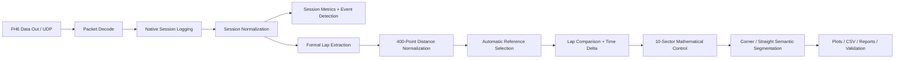

# Architecture

The project is structured as a staged telemetry-engineering pipeline. The public repository contains representative modules from the validated implementation; the private development repository remains the complete engineering source.

## Validated layers

| Layer | State |
|---|---|
| UDP reception, 324-byte decode, native logging | Validated |
| Native-to-normalized session adapter | Validated |
| Session plotting, metrics, event detection | Validated |
| Multi-session catalog/comparison/dashboard | Validated V1.0 |
| Formal-lap extraction and normalization | Validated V1.0 |
| Real lap comparison and time-delta reconstruction | Validated V1.0 |
| Automatic reference selection and 10-sector control | Validated V1.1 |
| Telemetry-derived corner/straight semantic analysis | Validated V1.1 |

## Design boundaries

The implementation intentionally keeps acquisition, normalization, analysis, comparison, plotting, and validation separated. The V1.1 semantic corner detector is telemetry-derived; it does **not** claim to reconstruct official circuit geometry or official corner names/numbers.
